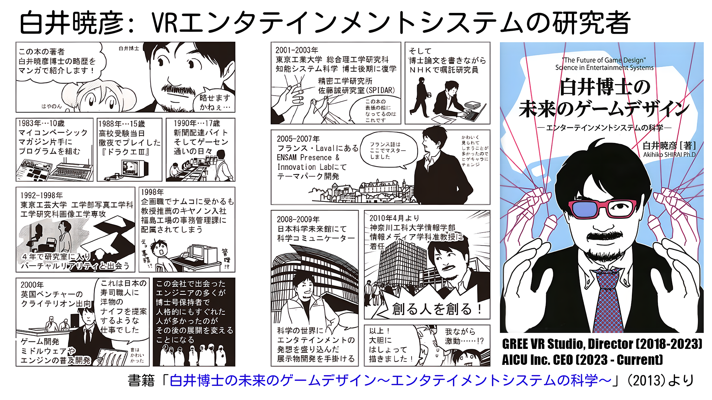

# Akihiko SHIRAI, Ph.D - CEO of AICU Inc.

## Creator{Author/CEO/Researcher} of Entertainment System

## Akihiko SHIRAI, Ph.D. - CEO of AICU Inc.

### Creator{Author/CEO/Researcher} of Entertainment Systems

Akihiko SHIRAI, Ph.D. (Engineering), is a researcher specializing in AI metaverse and entertainment virtual reality, and a prolific creator in these fields. He is the CEO of [AICU Inc.](https://corp.aicu.ai/) and a Project Professor at Digital Hollywood University Graduate School, where he leads the [Creative AI Lab](https://akihiko.shirai.as/dhgs).

Dr. Shirai's expertise spans across metaverse research and development, VR entertainment systems, media art, photographic engineering, image engineering, and generative AI. He graduated from Tokyo Polytechnic University with a degree in Photographic Engineering and earned his Master's degree in Image Engineering from the same institution.  He gained industry experience at Canon and Criterion Software (UK), contributing to the development of RenderWare, a pioneering game engine.  Driven by a desire to shape the future of gaming, he returned to academia and obtained his Ph.D. in Engineering from Tokyo Institute of Technology in 2003, focusing his research on "VR Entertainment Systems."

His career includes positions as an R&D researcher at NHK Engineering Services, a Visiting Researcher at École Nationale Supérieure d'Arts et Métiers (ENSAM) in France, a Science Communicator at the National Museum of Emerging Science and Innovation (Miraikan),  Associate Professor at Kanagawa Institute of Technology, and an Affiliate Professor at Digital Hollywood University Graduate School.

Throughout his career, Dr. Shirai has consistently been at the forefront of VR entertainment system research and development, talent cultivation, and dissemination of knowledge. He has presented cutting-edge UX concepts at international conferences such as ACM SIGGRAPH, IEEE MetaCom, Laval Virtual, and CEDEC.  From 2018 to 2023, as Laboratory Director at GREE VR Studio, he spearheaded UX research and development in avatar-driven metaverse and VR live entertainment.

In 2023, Dr. Shirai founded AICU, an international startup envisioned as an AI creator union, with the mission to "Creating People Who Create in the AIDX era".  At Digital Hollywood University Graduate School's Creative AI Lab, he leads social implementation, experimentation, and outreach activities in manga, metaverse, avatars, generative AI, and creative service development. He also actively participates in "Tomoiki Metaverse" in Kanagawa Prefecture, promoting social participation for people with disabilities.

Dr. Shirai is the author of numerous books, including "The Future of Game Design: Science in Entertainment Systems," "Collaborating with AI to Become a God-level Illustrator," "Image Generation AI Stable Diffusion Startup Guide," and "[Image and Video Generation AI ComfyUI Master Guide](https://comfy.aicu.ai/) (scheduled for release on April 18, 2025)." He also authors the "Generative AI Stream" column in Impress's "窓の杜" (Forest of Windows) online magazine and actively disseminates information through his note blog "[AICU media](https://note.com/aicu)", and the monthly "[AICU Magazine](https://j.aicu.ai/kindle)". He can be found on X (formerly Twitter) as [@o_ob](https://x.com/o_ob).

## 白井暁彦博士 - AICU Inc. CEO

### エンターテインメントシステムのクリエイター {作家 / CEO / 研究者}

工学博士、白井暁彦。AIメタバースとエンターテインメントVR専門の研究者。多作なクリエイター。[AICU Inc.](https://corp.aicu.ai/) CEO。デジタルハリウッド大学大学院 特任教授、[クリエイティブAIラボ](https://akihiko.shirai.as/dhgs)主宰。

専門分野、メタバース研究開発、VRエンターテインメントシステム、メディアアート、写真工学、画像工学、生成AIなど多岐。東京工芸大学写真工学科卒業。同大学院工学研究科画像工学専攻修士課程修了。ゲーム業界先駆的ゲームエンジンRenderWare開発貢献のため、キヤノン、クライテリオン・ソフトウェア（英国）で業界経験。ゲームの未来を形作りたい強い思い。2001年、東京工業大学大学院へ。2003年、「VRエンターテインメントシステム」研究で博士（工学）号取得。

NHKエンジニアリングサービス研究開発研究員、フランス国立高等工芸学校（ENSAM）客員研究員、日本科学未来館（Miraikan）科学コミュニケーター、神奈川工科大学情報メディア学科准教授、デジタルハリウッド大学大学院客員教授など歴任。

VRエンターテインメントシステム研究開発、人材育成、知識普及の最前線。ACM SIGGRAPH、IEEE MetaCom、Laval Virtual、CEDEC等、国際会議で常に最先端UXコンセプト発表。2018年～2023年、グリーVR Studioラボディレクター。アバター駆動型メタバース、VRライブエンターテインメントにおけるUX研究開発を主導。

2023年、国際的スタートアップ企業「AICU Inc.」設立。「つくる人を創る (Creating People Who Create in the AIDX era)」ミッション。デジタルハリウッド大学大学院クリエイティブAIラボ。高等教育機関として研究活動。年間700本のブログ記事発信。「AICU media」や個人ブログで。AIイラストレーション、漫画、動画、アバター、メタバース、システム開発。生成AI時代クリエイティブサービス開発における社会実装、実験、アウトリーチ活動を指揮。先端事例、神奈川県福祉事業「ともいきメタバース」積極参加。障害者の社会参加促進。

著書多数。「白井博士の未来のゲームデザイン - エンターテインメントシステムの科学」、「AIとコラボして神絵師になる」、「画像生成AI Stable Diffusion スタートガイド」、「[画像・動画生成AI ComfyUI マスターガイド](https://comfy.aicu.ai/) (2025年4月18日発売予定)」、など。インプレス「窓の杜」でコラム「生成AIストリーム」執筆。noteブログ「[AICU media](https://note.com/aicu)」、月刊「[AICUマガジン](https://j.aicu.ai/kindle)」で積極的情報発信。X（旧Twitter）アカウント [@o_ob](https://x.com/o_ob)。

### 300文字程度のショートバイオ (2025/2/24更新)

メタバース研究開発、VRエンタメシステム、メディアアート、写真/画像工学、生成AIを専門とする博士(工学)。[デジタルハリウッド大学大学院 特任教授](https://akihiko.shirai.as/dhgs)。著書に「[未来のゲームデザイン](https://amzn.to/3QANoio)」「[AI神絵師](https://amzn.to/4i7b0qK)」「[Stable Diffusion スタートガイド](https://j.aicu.ai/SBXL)」「[ComfyUIマスターガイド](https://comfy.aicu.ai/) (2025年4月18日発売予定)」。インプレス「窓の杜」で「[生成AIストリーム](https://forest.watch.impress.co.jp/docs/serial/aistream/index.html)」連載。「つくる人をつくる」AICUグループCEO。AIクリエイター支援。[AICU media](https://note.com/aicu)等で情報発信。

### 略歴 (講演用 2025/2/24更新)

VRエンタテインメントシステムの研究者。東京工芸大学写真工学科卒、[工学研究科画像工学専攻修士課程修了](/PDF/9662005.pdf)。キヤノン、英国クライテリオン・ソフトウエア社で世界初の産業用ゲームエンジン開発に参加後、東京工業大学大学院にて博士(工学)取得。NHKエンジニアリングサービス・次世代コンテント研究室、フランス国立高等工芸学校客員研究員、日本科学未来館科学コミュニケーター、神奈川工科大学准教授を経て、現職。[デジタルハリウッド大学大学院 特任教授](https://akihiko.shirai.as/dhgs)、「[クリエイティブAIラボ](https://akihiko.shirai.as/dhgs)」主宰。

グリー株式会社 GREE VR Studio Laboratory Directorとしてアバター駆動メタバース、VRライブエンタテイメントのUX研究開発を主導。国際的な舞台(ACM SIGGRAPH, IEEE MetaCom, Laval Virtual, CEDEC等)で常に最先端のUXを提案。

スタートアップ企業「AICU Inc.」「AICU Japan株式会社」CEOとして、メタバース、アバター、生成AIとクリエイティブサービス開発における社会実装・実験・発信活動を推進。神奈川県「[ともいきメタバース](https://note.com/hashtag/%E3%81%A8%E3%82%82%E3%81%84%E3%81%8D%E3%83%A1%E3%82%BF%E3%83%90%E3%83%BC%E3%82%B9)」とも連携。

著書に「[白井博士の未来のゲームデザイン -エンターテインメントシステムの科学-](https://amzn.to/3QANoio)」「[AIとコラボして神絵師になる](https://amzn.to/4i7b0qK)」「[画像生成AI Stable Diffusion スタートガイド](https://j.aicu.ai/SBXL)」「[画像・動画生成AI ComfyUI マスターガイド](https://comfy.aicu.ai/) (2025年4月18日発売予定)」など。インプレス「窓の杜」にて「[生成AIストリーム](https://forest.watch.impress.co.jp/docs/serial/aistream/index.html)」連載中。

### 受賞歴（抜粋）
- [第1回生成AIアートバトル「AIBATO」優勝](https://note.com/o_ob/n/nf7a760746933)
- Hello Tomorrow Global Summit Top 500 startups “Multiplex World Augmentation Display"
- ACM SIGGRAPH ASIA 2012 Emerging Technologies Prize，
- ACM Student Research Competition, Bronze Award, Laval Virtual Award 2015，
- 経産省Innovative Technologies 2013受賞（「2x3D」2D+3D互換の多重化ディスプレイシステム），CEDEC2012 インタラクティブセッション大賞，- CEDEC2014 インタラクティブセッション3位，CEDEC2016 インタラクティブセッション「オーディエンス賞」2位，ニコニコ超会議2015「第8回 ニコニコ学会β シンポジウム」（来場者15万人）にて会場投票で1位となる金賞を受賞, 他．

# 著書 Books (new to old)

1. [画像・動画生成AI ComfyUI マスターガイド](https://comfy.aicu.ai/) 2025年4月18日発売予定
1. [画像生成AI Stable Diffusion スタートガイド](https://j.aicu.ai/SBXL)
1. [AIとコラボして神絵師になる 論文から読み解くStable Diffusion](https://ivtv.page.link/ap) 
1. [白井博士の未来のゲームデザイン ―エンターテインメントシステムの科学―](http://aki.shirai.as/entsys/)
1. [WiiRemote プログラミング](http://akihiko.shirai.as/projects/WiiRemote/)

### Media presences 

- フジテレビ「週刊フジテレビ批評」2023/8/25 
[生成ＡＩでメディアはどう変わるのか？驚きの最先端技術をスタジオ実演！ハリウッドのデモの要因にも･･･未来への展望と課題を検証](https://twitter.com/FUJICC_staff2/status/1692734674416885850)

-　NHK「漫画家イエナガの複雑社会を超定義」 2023/5/12 放映
[【漫画で解説】注目のバズワード「ジェネレーティブAI」が社会を変える！？](https://www.nhk.jp/p/ts/1M3MYJGG6G/blog/bl/pp2BabPyzp/bp/pJv5r5m1OD/)

## 白井暁彦 経歴 (アカデミック向け)

**学歴**

* **1996年:** 東京工芸大学 工学部 写真工学科 卒業
* **1998年:** 東京工芸大学大学院 工学研究科 画像工学専攻 修了
* **2003年:** 東京工業大学大学院 総合理工学研究科 知能システム科学専攻 博士後期課程修了、博士(工学)取得

**職歴・活動歴**

* **1998年 - 2001年:** キヤノン株式会社、クライテリオン・ソフトウェア社 (ゲーム開発コンサルタント)
* **2003年 - 2004年:** 財団法人NHKエンジニアリングサービス 次世代コンテンツ研究室 (研究員)
* **2004年 - 2007年:** フランス国立高等工芸学校 (ENSAM) 客員研究員
* **2006年 - :** Laval Virtual ReVolution セッションオーガナイザー
* **2007年 - 2010年:** 日本科学未来館 科学コミュニケーター、展示企画
* **2010年 - 2018年:** 神奈川工科大学 情報学部 情報メディア学科 准教授
* **2018年 - :** デジタルハリウッド大学大学院 客員教授
* **2018年 - 2023年:** グリー株式会社 GREE VR Studio Laboratory Director (REALITY株式会社出向)
* **2023年 - :** AICU Inc. CEO
* **2023年 - :** デジタルハリウッド大学大学院 特任教授
* **2024年11月11日 - :** AICU Japan 株式会社 代表取締役

**受賞歴 (抜粋)**

* **1997年:** 日本バーチャルリアリティ学会第2回大会にてFantastic Phantom Slipper初期型を発表
* **2012年:** CEDEC AWARDS 2012 インタラクティブセッション大賞 (多重化隠蔽映像技術 Scritter)
* **2012年:** ACM SIGGRAPH ASIA 2012 Emerging Technologies Prize (多重化隠蔽映像技術 Scritter)
* **2013年:** 経産省 Innovative Technologies 2013 (2D+3D互換多重化ディスプレイシステム 2x3D)
* **2014年:** CEDEC 2014 インタラクティブセッション3位 (多重化隠蔽映像技術 ExPixel)
* **2015年:** Laval Virtual Award 2015 (多重化隠蔽映像技術 ExPixel FPGA)
* **2015年:** ニコニコ超会議2015 第8回 ニコニコ学会β シンポジウム 金賞 (多重化隠蔽映像技術 ExPixel)
* **2015年:** 指導学生が ACM Student Research Competition, Bronze Award を受賞 (多重化隠蔽映像技術 ExPixel 関連)
* **2016年:** CEDEC 2016 インタラクティブセッション オーディエンス賞2位 (多重化多視点VRアーケードゲームシステム DUAL DUEL)
* **2020年:** 共著論文が情報処理学会 研究報告 2020-MUS-103(6) 優秀賞を受賞
* **2022年:** 共著論文が CyberWorlds 2022 Best short paper

### 所属学会等
- 日本VR学会
  - 国際学生VRコンテスト（[IVRC](https://ivrc.net/)）実行委員
- 一般社団法人[芸術科学会](https://art-science.org/) 副会長(2022-2024) [発信交流事業](https://note.com/o_ob/n/n944f7cf48960)
- 情報処理学会
- 映像情報メディア学会
- Laval Virtual Administrative Council (France)

### Contact

[Contact Form](https://corp.aicu.ai/ja) / [Twitter@o_ob](https://x.com/o_ob)
